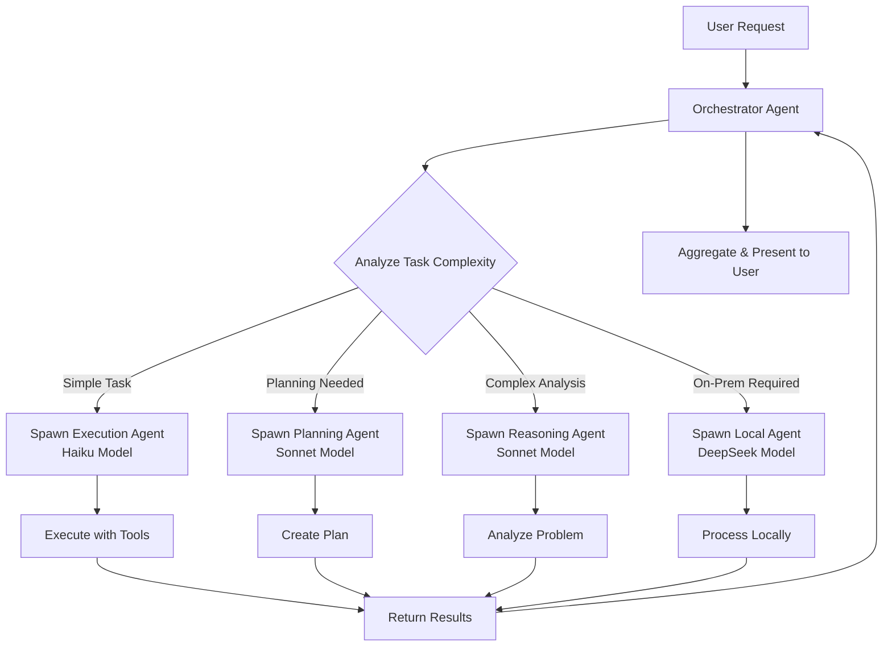

# Lace Architecture - Orchestrator-Driven Agent System

## Core Design Principles

### 1. Orchestrator-Driven Model Selection
The **calling agent (orchestrator)** chooses which model to use based on task requirements. The **execution agent** is told what model and role it has, rather than choosing for itself.

```javascript
// Orchestrator decides model based on task complexity
const planningAgent = new Agent({
  modelProvider: this.modelProvider,
  assignedModel: 'claude-3-5-sonnet-20241022', // Powerful model for planning
  assignedProvider: 'anthropic',
  role: 'planning',
  task: 'Design authentication system architecture'
});

const executionAgent = new Agent({
  modelProvider: this.modelProvider,
  assignedModel: 'claude-3-5-haiku-20241022', // Fast model for execution
  assignedProvider: 'anthropic', 
  role: 'execution',
  task: 'Run unit tests for auth module'
});
```

### Benefits:
- **Cost Control**: Expensive models only used when needed
- **Role Clarity**: Each agent knows its purpose and capabilities
- **Dynamic Optimization**: Right model for the right task
- **Clean Separation**: Orchestration logic vs execution logic

## Agent Hierarchy

### Primary Agent (Orchestrator)
- **Role**: `orchestrator`
- **Model**: `claude-3-5-sonnet-20241022` (powerful reasoning)
- **Responsibilities**:
  - User interaction and conversation management
  - Task analysis and complexity assessment
  - Model selection for subtasks
  - Subagent coordination and delegation
  - Context management and handoffs

### Specialized Subagents

#### Planning Agent
- **Role**: `planning`
- **Model**: `claude-3-5-sonnet-20241022` or `o3-mini` (future)
- **Use Cases**: Architecture design, complex task breakdown, requirement analysis
- **Capabilities**: `['planning', 'reasoning', 'analysis']`

#### Execution Agent  
- **Role**: `execution`
- **Model**: `claude-3-5-haiku-20241022` (fast and efficient)
- **Use Cases**: Running commands, file operations, simple tasks
- **Capabilities**: `['execution', 'tool_calling']`

#### Reasoning Agent
- **Role**: `reasoning` 
- **Model**: `claude-3-5-sonnet-20241022`
- **Use Cases**: Debugging, complex analysis, architectural decisions
- **Capabilities**: `['reasoning', 'analysis', 'debugging']`

#### Memory Agent
- **Role**: `memory`
- **Model**: Previous generation agent (any model)
- **Use Cases**: Historical context queries, conversation archaeology
- **Capabilities**: `['memory_retrieval', 'context_provision']`

## Task Delegation Flow



## Model Provider System

### Multi-Provider Support
```javascript
const modelProvider = new ModelProvider({
  anthropic: { /* config */ },
  openai: { /* config */ },      // Future: GPT-4, o3
  local: { /* config */ }        // Future: DeepSeek, Llama
});
```

### Provider Selection Examples
```javascript
// Advanced planning (future)
const planningAgent = new Agent({
  assignedProvider: 'openai',
  assignedModel: 'o3-mini',
  role: 'planning'
});

// Privacy-sensitive tasks (future)
const localAgent = new Agent({
  assignedProvider: 'local', 
  assignedModel: 'deepseek-v3',
  role: 'execution'
});

// General reasoning
const reasoningAgent = new Agent({
  assignedProvider: 'anthropic',
  assignedModel: 'claude-3-5-sonnet-20241022',
  role: 'reasoning'
});
```

## Agent Configuration

### Constructor Pattern
```javascript
const agent = new Agent({
  // Core infrastructure
  tools: toolRegistry,
  db: conversationDB,
  modelProvider: modelProvider,
  
  // Assignment from orchestrator
  assignedModel: 'claude-3-5-haiku-20241022',
  assignedProvider: 'anthropic',
  role: 'execution',
  task: 'List files in current directory',
  capabilities: ['execution', 'tool_calling'],
  
  // Context management
  generation: 1,
  inheritedContext: compressedContext,
  memoryAgents: previousGenerations
});
```

### Role-Specific System Prompts
Each agent receives behavior guidelines specific to its role:

- **Orchestrator**: Coordinates and delegates, manages workflow
- **Planning**: Breaks down complex tasks, analyzes requirements  
- **Execution**: Executes specific tasks efficiently with tools
- **Reasoning**: Analyzes problems, provides detailed insights
- **Memory**: Serves as historical context oracle

## Context Management & Memory

### Multi-Generational Memory System
1. **Active Agent**: Current conversation context (80% capacity limit)
2. **Memory Agents**: Previous generations kept alive as queryable oracles
3. **Conversation Database**: Persistent full history storage
4. **Context Handoff**: Seamless transition with compressed context

### Handoff Process
```javascript
// At 80% context capacity
const compressedContext = await currentAgent.compressContext();

// Create new generation
const newAgent = new Agent({
  generation: currentGeneration + 1,
  inheritedContext: compressedContext,
  memoryAgents: new Map([[currentGeneration, currentAgent]]),
  role: 'orchestrator',
  assignedModel: 'claude-3-5-sonnet-20241022'
});

// Old agent becomes memory oracle
memoryAgents.set(currentGeneration, currentAgent);
```

## Tool Integration

### Tool Schema to LLM Format
```javascript
// Tool registry schema
{
  name: 'file',
  methods: {
    read: { description: 'Read file contents', parameters: {...} },
    write: { description: 'Write file contents', parameters: {...} }
  }
}

// Converted to LLM format
[
  { name: 'file_read', description: 'File operations: Read file contents', parameters: {...} },
  { name: 'file_write', description: 'File operations: Write file contents', parameters: {...} }
]
```

### Tool Execution Flow
1. LLM returns tool calls: `[{name: 'file_read', input: {path: './test.js'}}]`
2. Agent parses: `toolName='file', methodName='read'`
3. Tool registry executes: `tools.callTool('file', 'read', {path: './test.js'})`
4. Results returned to LLM for further processing

## Future Extensibility

### Additional Providers
- **OpenAI**: o3 for advanced planning, GPT-4 for general reasoning
- **Local**: DeepSeek, Llama for on-premise deployment
- **Specialized**: Code-specific models, domain-specific fine-tunes

### Advanced Agent Types
- **Code Review Agent**: Specialized for PR analysis
- **Security Agent**: Focus on vulnerability detection  
- **Performance Agent**: Optimization and profiling
- **Documentation Agent**: README and API doc generation

### Dynamic Model Selection
Future enhancement to analyze task characteristics and automatically select optimal model/provider combinations based on:
- Task complexity metrics
- Cost/latency requirements  
- Privacy/security constraints
- Available model capabilities